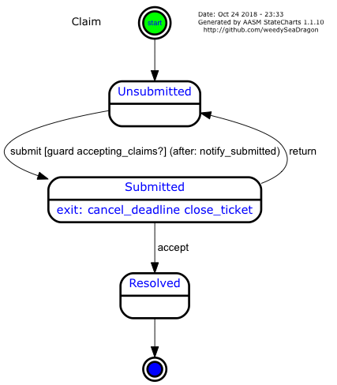

aasm_statecharts
================

`aasm_statecharts` is a utility for generating UML statechart diagrams from state machines defined using [AASM](https://github.com/aasm/aasm). Unlike other state diagram generators, it can express extended finite state machine concepts such as guards and entry actions.

**Note:**  This fork is updated to work with **rails 5** and **aasm 4**.  This will **not** work with aasm < 4.0

Requirements
------------
- rails >= 5.0
- aasm >= 4.0
- ruby-graphviz >= 1.0


Installation and Invokation
---------------------------

You can install `aasm_statecharts` from RubyGems using `gem install aasm_statecharts`, or add the `aasm_statecharts` gem to your Gemfile and run Bundler to install it.

If you have installed `aasm_statecharts` via gem, you can invoke it using the command `aasm_statecharts`; otherwise, if you have used Bundler without generating binstubs, you can invoke it with the command `bundle exec aasm_statecharts`. The following assumes that it has been installed via gem for simplicity.

Example
-------

Consider following model in `app/models/claim.rb`:
```rb
class Claim < ActiveRecord::Base
  belongs_to :user
  validates :title, presence: true
  validates :description, presence: true

  include AASM

  aasm do
    state :unsubmitted, initial: true
    state :submitted, exit: [:cancel_deadline, :close_ticket]
    state :resolved, final: true

    event :submit do
      transitions from: :unsubmitted, to: :submitted,
                  guard: :accepting_claims?,
                  after: :notify_submitted
    end
    event :return do
      transitions from: :submitted, to: :unsubmitted
    end
    event :accept do
      transitions from: :submitted, to: :resolved
    end
  end
  
  def accepting_claims?
  end
  
  def cancel_deadline
  end

  def close_ticket
  end
  
  def notify_submitted
  end
end
```

If we invoke `aasm_statecharts claim`, then the following diagram will be written to ./doc/claim.png:




Usage
-----

For more advanced usage information, see `aasm_statecharts --help`:

```

Usage: aasm_statechart [options] <model> [models ...]
 Where <model> is the lower case, underscored model name.  Ex:  'my_model' for the class MyModel

  This assumes that (1) you are using AASM code in your ruby source for the model, and
  (2) you have graphViz installed and in your PATH.  graphViz is what takes the .dot file and actually
  generates the final graphic file.

  If you are going to graph a model that is a subclass of ActiveRecord (or any other Rails class),
  you must run this from your <RailsRoot> directory.  Be sure to use the --directory option to specify the location of the models.

  Example: To create a graph for the model MembershipApplication that is a subclass of ActiveRecord (in Rails):
    aasm_statecharts application

  Example: For the Application model above,create a .jpg file and put it in the ./output/graphs directory and use the configuration file my_ugly_colors.yml:
    aasm_statecharts --directory ./output/graphs --config my_ugly_colors.yml --file jpg application 

  Example: To create a graph for the model Purchase that exists in the file ./models/purchase.rb and Purchase does NOT inherit from anything in Rails:
    aasm_statecharts --no-rails --include ./models purchase   

Options:
    -a, --all                        Generate diagrams for all models in the current or included directory.
    -r, --root ROOT_MODEL            Generate diagrams for this ROOT_MODEL and all of its subclasses. (The ROOT_MODEL is also diagrammed.)
    -s, --subclass-root ROOT_MODEL   Generate diagrams for all of the subclasses of this ROOT_MODEL. (The ROOT_MODEL is not diagrammed.
    -n, --no-rails                   Do not load Rails. (The model(s) are not subclasses of ActiveRecord or anything in Rails.)
    -i, --include PATH               Include the path in the load path.
                                        PATH can have multiple directories, separated by your OS separator :
    -d, --directory DIRECTORY        Output to a specific directory (default: ./doc)
    -c, --config FILE                Use the config file named FILE
    -t, --table                      Create a state transition table
    -e, --enter-exit-hide            Hide (do not show) the 'enter:' and 'exit:' labels on each state node 
    -f, --file-type TYPE             Output in the specified format (default: png), which must be one of the following: 
                                        bmp, canon, cmap, cmapx, cmapx_np, dia, dot, eps, fig, gd, gd2, gif, 
                                        gtk, hpgl, ico, imap, imap_np, ismap, jpe, jpeg, jpg, mif, mp, none, 
                                        pcl, pdf, pic, plain, plain-ext, png, ps, ps2, svg, svgz, tga, tif, 
                                        tiff, vml, vmlz, vrml, vtx, wbmp, xdot, xlib, .
    -g [graph | nodes | edges | colors ],
        --graph-configs              Show all of the configuration options (from graphViz). (No model is needed.)
                                        Optionally specify [graph | nodes | edges] to show the options for just that thing.
                                        If no option is specified, all options are shown.
    -v, --version                    version of this gem
```
